# 从程序员视角解决应试雅思

# **方法篇**

敏捷开发的思想非常重要！一次准备的战线不宜长于三个月。就像一次面试，总有刷不完的力扣题。只有面试之后才能知道自己的长处/短处【听说读写哪些小分已经达标可以适当少刷，哪些还有提升空间可以多刷】，根据分数的量化反馈针对性补充自己的短板。

真题非常重要！类比技术面试时总会针对性刷某个公司的真题，每一套真题都要反复去刷。阅读和听力相对来说因为有标准答案会更容易提升，根据其答案回溯文章内容查找依据，分析自己错的原因；但写作和口语 这两种作为非显性boolean分数参考的部分，需要更多的时间提升自己条件反射下想到的答案，需要自己一定时间的沉淀积累精华句子和话题素材准备。万变不离其宗，类比技术面中核心算法就是那几种bfs dfs 二分查找 etc，只有懂得其中核心及套路才能应对新的主题也不怕。

# 环境搭建

**app** 小站雅思(免费 需要添加助教vx登记注册手机号) 核心用途是练听力 写作及口语机经 如下图

**听力**
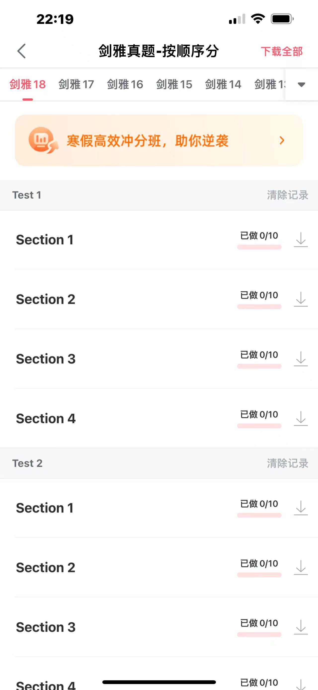

**口语机经**

**写作机经**
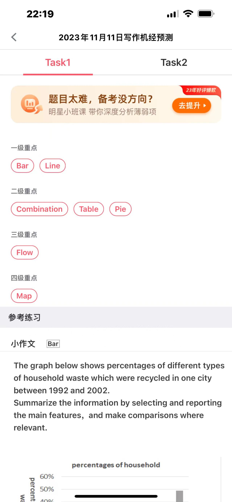

机经非常重要！尽量不要在换题的时期去考试，根据网上存在的真题自己巩固知识。

准备材料 >> 纸质书 【闲鱼有便宜版本】 | 选择上机考试的同学可以选择网上下载pdf适应做题习惯

# 实际案例
想到如果单纯从高维度来聊考试的话过于概括，下面根据一套真题来突出需要注意的点。【以下真题出自于剑桥16 第一套】

https://kbtxwer.github.io/IELTS/#

[https://kbtxwer.github.io/IELTS/剑桥雅思官方真题集16 （学术类）.pdf](https://kbtxwer.github.io/IELTS/%E5%89%91%E6%A1%A5%E9%9B%85%E6%80%9D%E5%AE%98%E6%96%B9%E7%9C%9F%E9%A2%98%E9%9B%8616%20%EF%BC%88%E5%AD%A6%E6%9C%AF%E7%B1%BB%EF%BC%89.pdf)

第12页开始

**听力**
做题技巧 

拿到卷子考官说可以开始看卷子之后快速过一遍part 1文字内容【part 1相对来说是最简单的 均以填空形式出现】，首先意识到是要求回答是一个词 and/or 一个数字，给自己心理暗示答案不会是两个词及其他，也要注意听出现过的数字【练习的时候可以尝试记下所有出现过的数字，以往真题出现过要求填电话号码 😭】

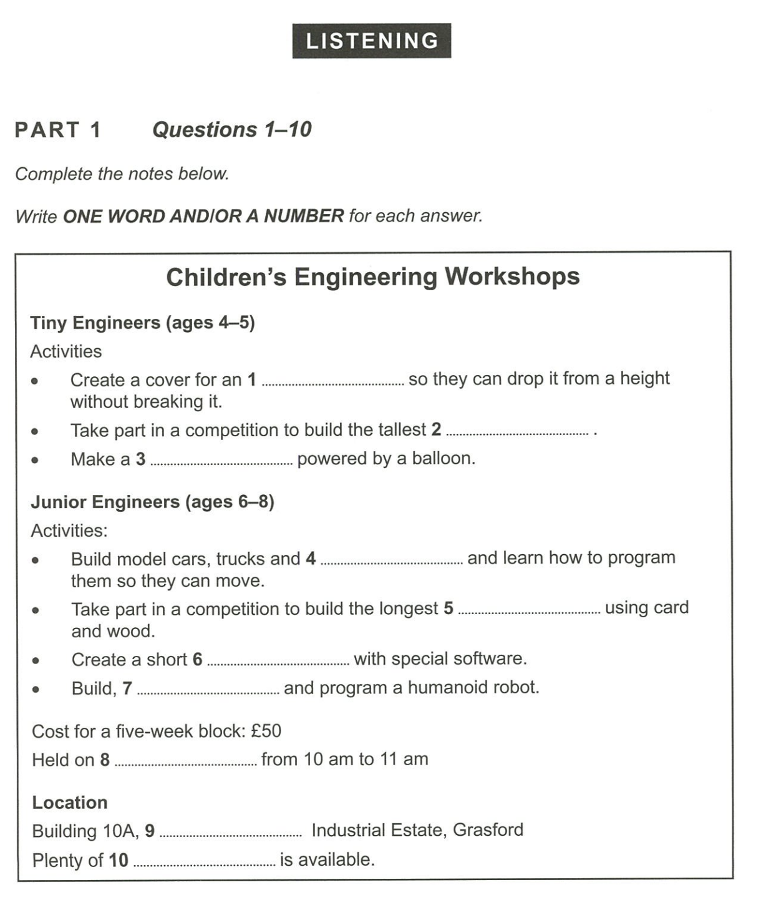

阅览文章内容，确定答案形式：

如answer 1前面的词是an,推导出1的答案是一个名词，可以写一个noun提示自己，也需要注意后文without breaking it的意义，以防听力内容出现倒装形式，错过正确答案。

如answer 2中确定答案是名词，圈画关键提示词tallest

如answer 4中根据前面单词model car, truck等的名词内容，暗示答案有可能是与车相关的名词内容

如answer 7中根据build, program得知是动词答案

如answer 8关键词圈画数字10 11

如answer 10圈画available关键词，有可能文章内容以倒装形式出现。

文章读完之后快速检查自己有没有空的答案，如果有的话根据仅存的记忆先写上一个脑海中觉得最有可能的答案，快速翻到下一篇文章。

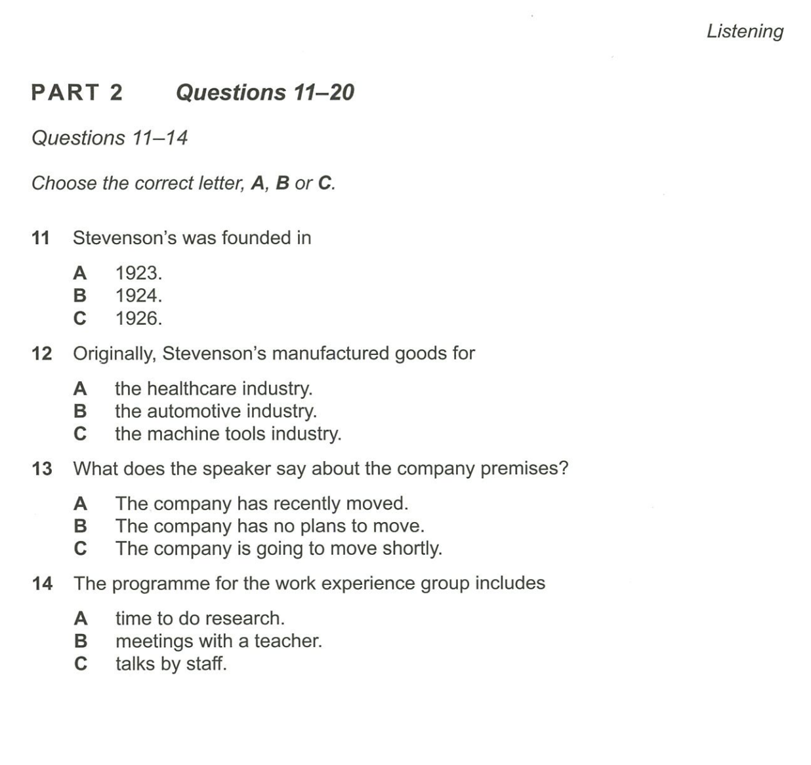

类似这一篇文章，首先看到是单选题

11 自己脑海中加深印象founded【听力有可能以其他词呈现】,关键词three \ four \ six

12 关键词originally 【注意，不是现在的业务而是最原始的】,healthcare, automotive, machine

13 关键词recenlty \ no plan \ going to shortly 

14 关键词 做研究 \ 老师会议 \ 职员分享

像下面的这种地形图绝对是相对来说比较灾难的问题😭，需要多加练习 多磨耳朵

首先快速过一遍给的名词选项【因为不一定是按照顺序讲答案】，然后更多的时间花在初步位置的记忆，如factory对着的是abc, reception的位置靠着谁，access road和main road相对应的字母有哪些。

以上都应该在听力播放之前快速过一遍，在脑海中加一层缓存层【多加练习】

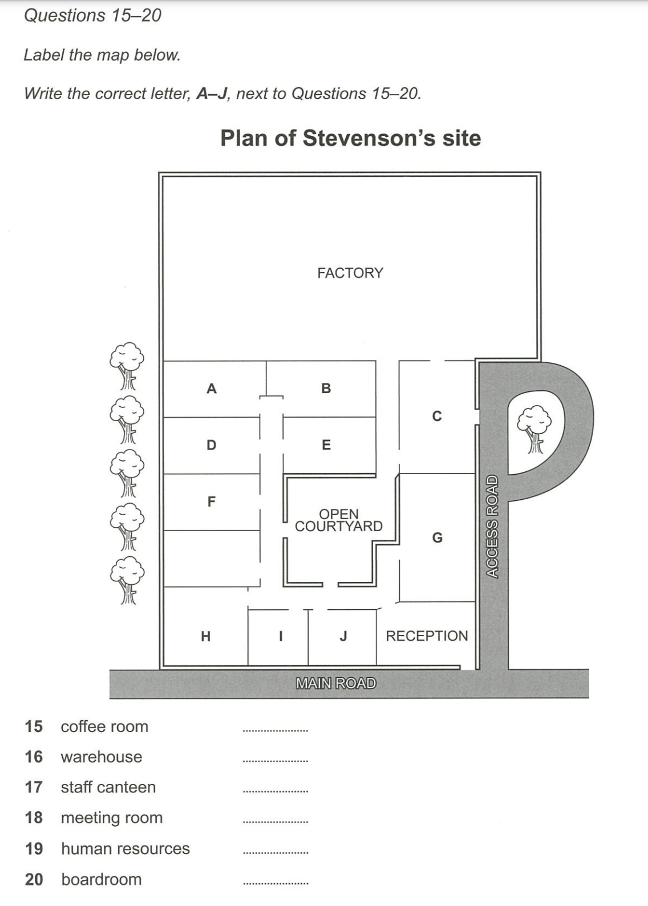

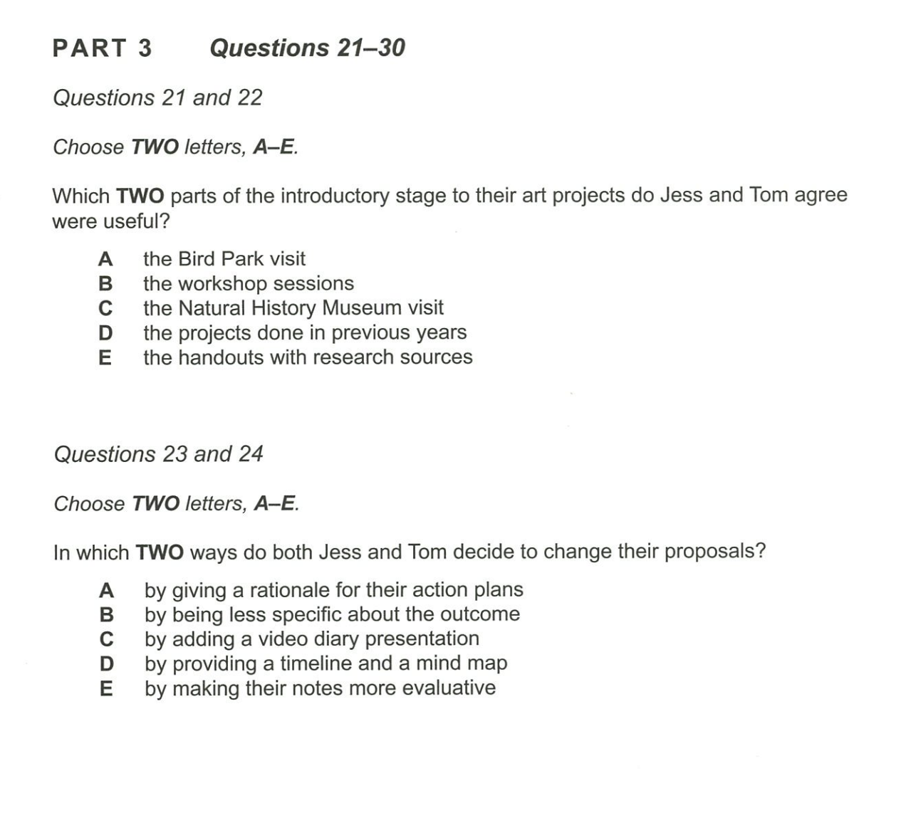

首先留意到与之前选择不一样，题目21和22都要求是5选2

**更精细**的来看 >> 

如21，发现a和c可能存在着互斥关系，其他关键词如workshop \ done in previous \ handout

如22，rationale同义词reason等【不会的话很正常，做完之后稍微记下就好了】 \ less outcome \ video presentation \ evaluative notes

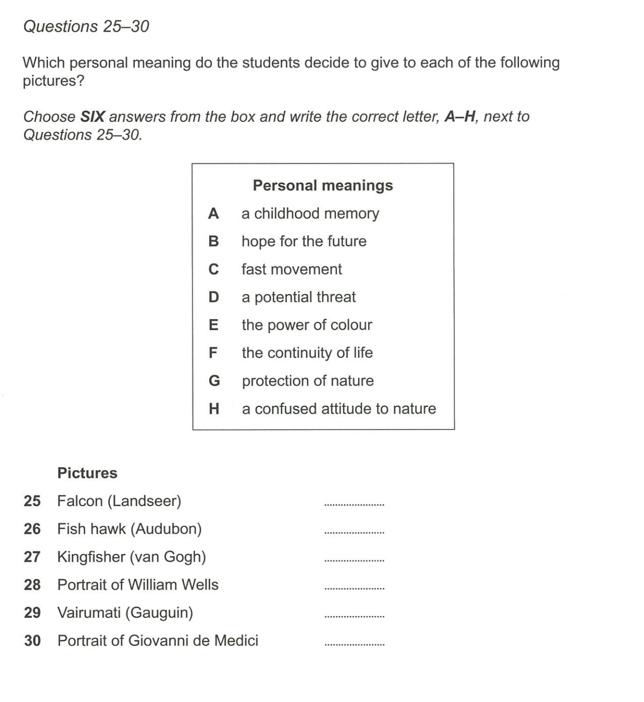

首先读题，是画名和画意义的对照，分清主次首先快速过一遍画的名字，括号里面的是画家，画家有谁，画名的开头字母是什么，对自己心理暗示会听到什么打头的单词。然后花更多的时间去看画的意义，圈画关键词childhood \ future \ fast \ thread \ color \ life \ nature \ confused nature, 然后抠字眼注意到有可能模糊的答案B和F，G和H。进一步圈画区分开他们的关键词。【这种区别关键词的思想在回答阅读答案中也同样重要】

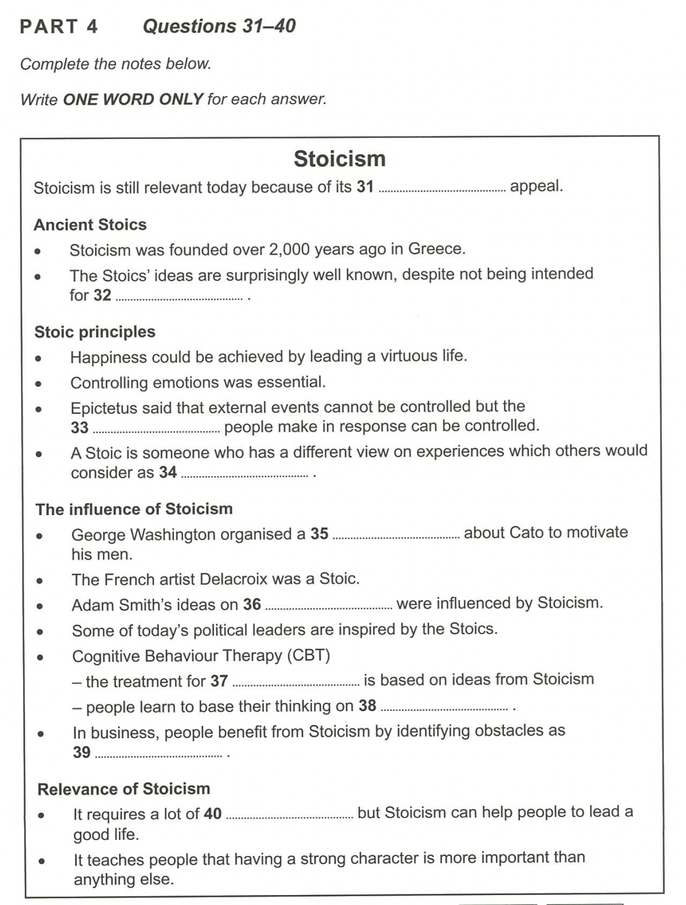

首先圈画关键词one word only,意识到答案形式和part 1不一样，不会有多个单词也不会出现数字。然后细致来看根据之前三个part的模版画出关键词。

**最后**

总结来看，因为答案形式的原因part1和4是相对简单的部分，2和3相对困难，模拟的时候应该多花时间准备类似的真题。在做一遍真题之后总结听力内容出现答案的模式套路，根据答案反推自己应该画出的关键词帮助记忆，从而得到提高分数的效果。

## 阅读

与听力类似，也是先花时间看问题的格式再粗读文章脉络。注意三篇用时参考时间应为18,20,22min

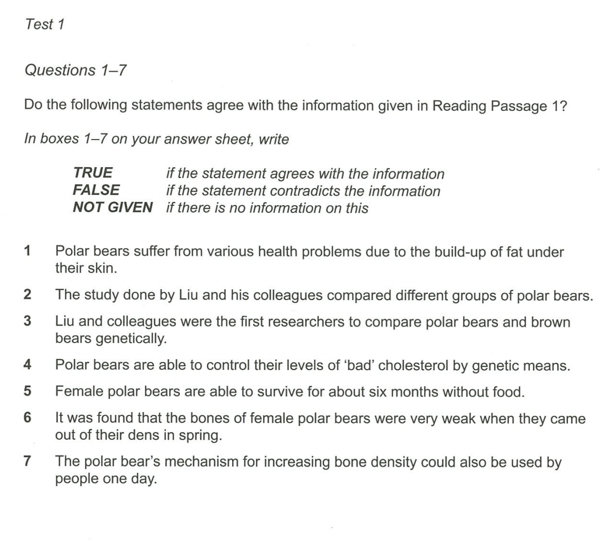

## 写作

机经很重要！可以在小站雅思app里找到近期题目

根据官网，打分按照四个维度进行，任务完成度、连贯性和衔接性、词汇资源【高级单词使用量】以及语法范围和准确性 【注意不要盲目使用高级词汇，需要根据场景相匹配使用,就像在需要保证ACID场景下应该使用关系型数据库】

附网站英文原文:

【Writing Task 1 are assessed against the following criteria: task achievement, coherence and cohesion, lexical resource and grammatical range and accuracy. Writing Task 2 is assessed in much the same way except for the task response criterion.】

https://ielts.idp.com/hongkong/results/scores/writing/en-gb

详细案例 >>

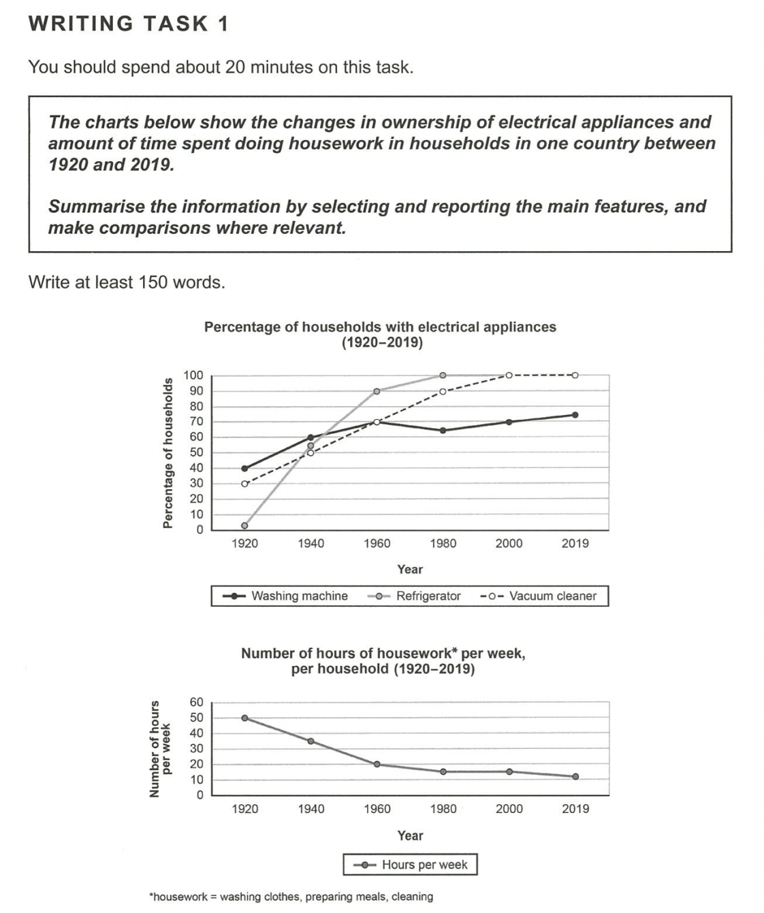

小作文出现描述线状图的概率非常之高，建议多花时间。老规矩先读题，第一段是对两张图的概括，第二段是回答要求。

如果是第一次遇见可以直接看答案，有官方给出不同分数的标准答案。分析其中值得这个分数的缘由【以下为给分5.0答案，着重看考官评语，5分的咱就不学习了】

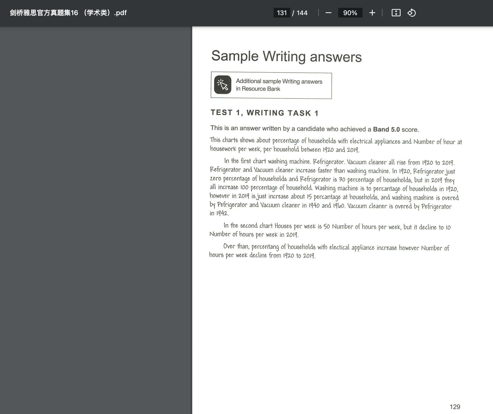

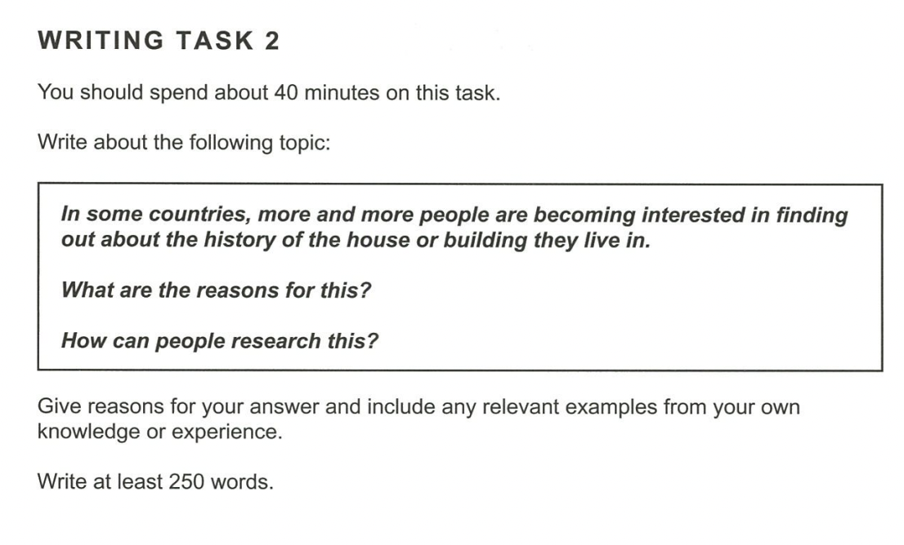

官方6分参考答案

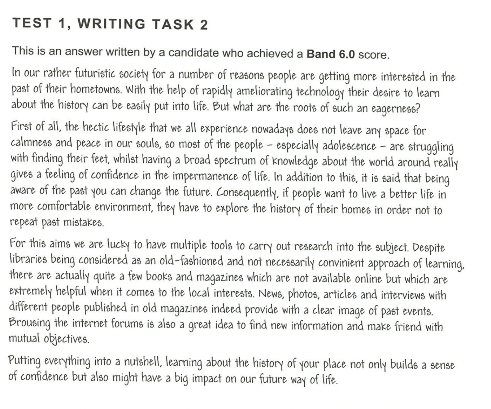

考官评语

这是一篇官方给分6分的文章：

**写的好的地方**

value很发散

文章结构好，介绍 - 观点细节陈述 - 结尾

用词

词汇搭配【含举例】

**写的待提高的地方**

没有写题目要求关于history的描述

用词出现错误

**最后**

积累素材很重要，需要多看面经和多想句式。从最开始根据考官评语分析文章的好坏，到自己学会好的句式灵活运用在相对应的题目里面【关于词汇资源，就像咱群里之前提到的，积累词汇必定是不可缺失的一环，从官方答案中自行总结interface，应用在自己的项目serviceImpl之中，起到举一反三的作用】

## 口语

类似写作，机经很重要！也可以在小站雅思app里找到近期题目

推荐**油管频道**，参照不同分数的答案进行分析，积累素材.

https://www.youtube.com/playlist?list=PL_h2Hjbzpl8eTmqN0LVIR9hGKZ-SnNm5w

从官方的评分标准看，这方面主要从四个维度来看,流畅性和连贯性、词汇资源、语法范围和准确性以及发音

【Fluency and coherence, lexical resource, grammatical range and accuracy, and pronunciation】

https://ielts.idp.com/hongkong/results/scores/speaking/en-gb

其中最直接能显著提升的就是流畅度和准确度 >> 

**流畅度** >> 最直接的方法就是找外教或者自己录音自己讲的答案，评判自己的流利程度和用词准确度，宁愿慢一点也要尽量“啊”“emm”“呃”之类的卡壳【影响面试官听感】，反复练习直到自己和标准答案中的程度类似。

**准确度** >> 最直接的方法就是根据机经自行准备主干答案。就像面试时被问到“如何解决之前遇到的技术困难”，在脑海中已经缓存了相应的答案模版，没有刻意展开到其他方面。

# 其他

相对而言，如果想加快进度的话可以报班，尤其是写作和口语。

利用碎片化时间 几分钟听一篇文章或者看看面经 脑海中想象自己会怎么写 哪些是想不到的

地点会吃亏: 留意到咱们很多同学常驻坐标都在北京。事实上一线城市确实存在压分的现象【特别体现在口语部分】，有条件的同学可以转战非一线城市考一下，说不定有意想不到的结果。

未完待续…【想到再补充】